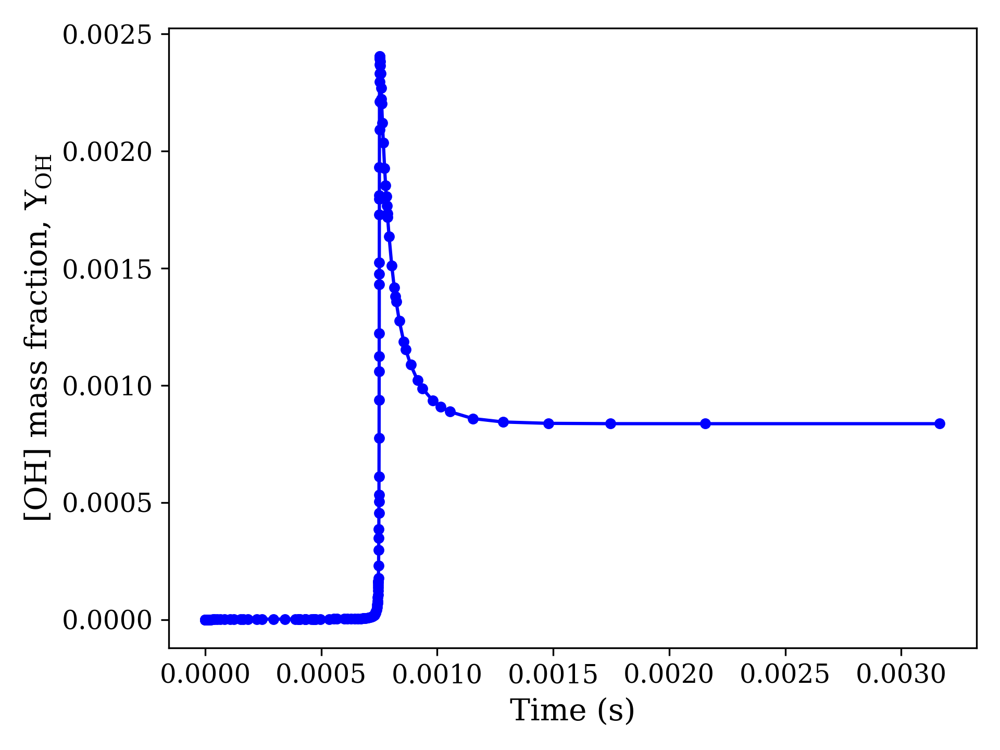
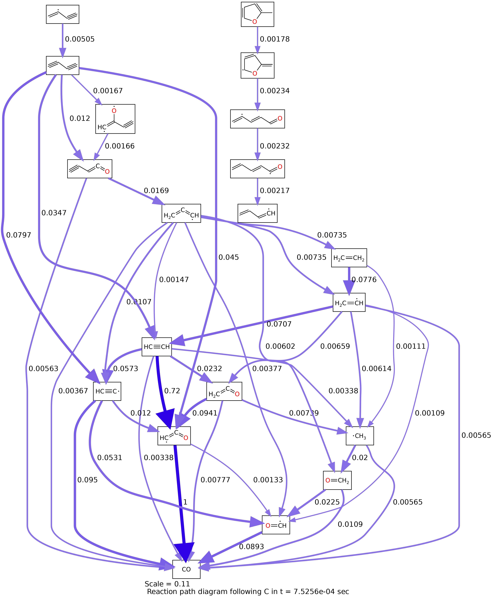

# Flux diagram
This script simulates your Shock Tube system through different time intervals and creates flux diagrams with species molecule images.

- Clone these scripts to a new folder: `Flux diagram`    
- In the Cantera environment in terminal, install `conda install -c conda-forge pdf2image`   
- Copy from your RMG run the Cantera output `chem_annotated.cti` and paste it in the folder, (the given file is for running a test, so you can just rename it).   
- Same with the species dictionary `species_dictionary.txt`, (the given file is for running a test, so you can just rename it).  
- In the first code block in `cte_replace_labels_to_smiles v2.ipynb` change the 4 paths to your files' location.   
- Change the initial operating conditions of your Shock Tube system in the first code block in `cte_replace_labels_to_smiles v2.ipynb`.  
- Put attention to your system's elements. Cantera lables them as one thing and Smiles as another thing, you should consider that in the code itself.  
For instance, Argon's label in `cti` file is `Ar`, but in Smiles its label is `[Ar]`. For elements, you should consider Cantera's notation. Two cases are considered in the script: `Ar` and `Ne`.  
- Run the script `cte_replace_labels_to_smiles v2.ipynb` under Cantera environmemt.

## Output: 
Ignition delay time plot in the folder:  
  

11 folder for 11 different times intervals: 
0.5tau, 0.6tau...tau, 1.1tau,...1.5tau 
In each folder you will find a `png` file which contains the flux diagram specified in theat time.   
For example:   
  
